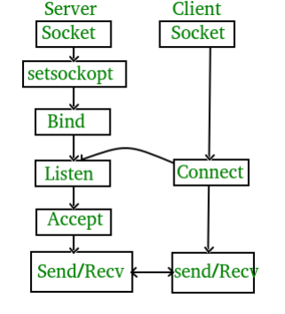
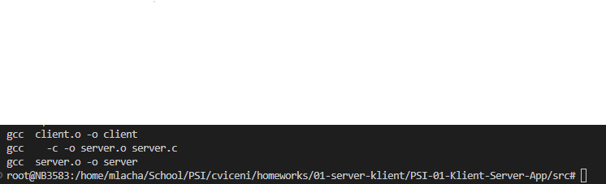
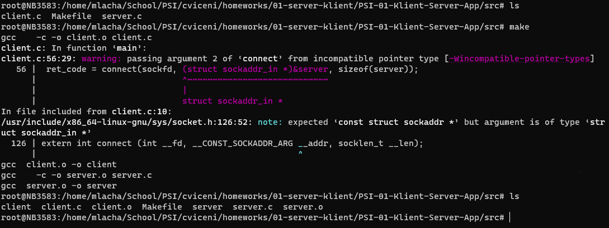
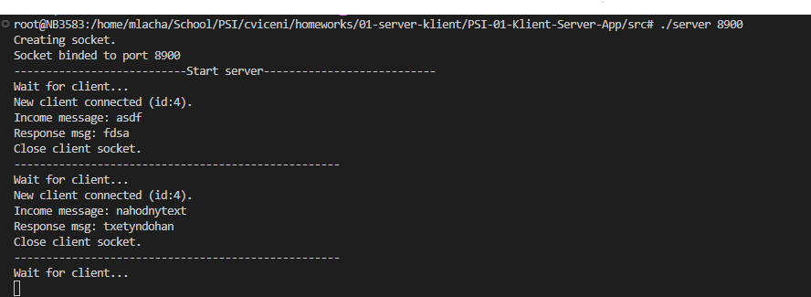
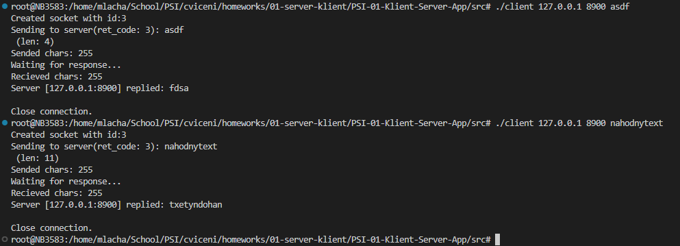

# TCP server a klient

Tento projekt obsahuje jednoduchý TCP server a klient aplikaci, kteří mezi sebou komunikují pomocí jednoduchých zpráv.

## Zadání
### Popis
Implementujte vícevláknový TCP server, který bude poslouchat na portu zadaném z příkazové řádky. Jeho úkolem je od klienta přijmout řetězec o maximální délce 255 znaků a poslat jej zpět klientovi obrácený (př. ABCD → DCBA). Délka řetězce se v obou případech nachází v prvním bytu zprávy.

### Technické podmínky
- K implementaci použijte rozhraní BSD socketů v programovacím jayzce C/C++, Java nebo Python.

- Použijte také sestavovací program tak, aby bylo možné obě aplikace snadno sestavit jediným příkazem (make, Cmake, Maven, Gradle)

## Implementace
Pro implementaci byl použit jazyk C a nástroj pro sestavení programu byl použit make. Komunikace serveru a klienta má vlastní životní cyklus, který je znázorněn na následujícím obrázku.



### Server
Na serveru se po spuštění zkontroluje počet parametrů.
```C
	if (argc != 2) {
		perror("Invalid count program arguments");
		perror("Usage: ./server <PORT>");
		exit(EXIT_FAILURE);
	}
```

Dále se vytvoří nový socket pro komunikaci s klienty a nastaví se dodatečně možnost znovupoužít adressu, pokud by server byl ukončen předčasně.
```C
    socket_desc = socket(AF_INET, SOCK_STREAM, 0);
	if (socket_desc == -1) {
		perror("Socket creation failed\n");
		exit(EXIT_FAILURE);
	}

    setsockopt(socket_desc, SOL_SOCKET, SO_REUSEADDR, &optval, sizeof(optval));
```

Dále se napojí socket na IP adresu a port serveru a následně začně naslouchat.
```C
    if (bind(socket_desc, (const struct sockaddr *) &server, sizeof(server)) < 0)
	{
		perror("Bind failed.\n");
		exit(EXIT_FAILURE);
	}

	if (listen(socket_desc, 1) < 0) {
		perror("Error while listen\n");
		exit(EXIT_FAILURE);
	}
```

Jelikož se na prvním bytu zprávy posílá její velikost, pak délku zprávy lze získat nasledujícím kódem, který převede první byte zprávy na číselnou hodnotu a zbytek zprávy posune o tento jeden byte.

```C
	// Get lenght of message from first byte of message
	buffer_len = (int) buffer[0];
	memmove(buffer, buffer + 1, buffer_len);
	buffer[buffer_len] = '\0';
```

Server pak už jen navazuje spojení s klienty ve while smyčce odkud přečte jejich zprávy a pomocí metody `reverse_string` tuto zprávu převráti a pošle jí zpět klientovi a ukončí s ním spojení.

### Klient

Stejně jako u serveru se zde nejprve kontroluje počet parametrů a délka zprávy, která se má poslat na server (omezena podle zadání na maximální délku 255 znaků).

```C
	if (argc != 4) {
		printf("Usage: %s <IP v4 address> <PORT> <String>\n", argv[0]);
		exit(EXIT_FAILURE);
	}

	int msg_len = strlen(argv[3]);
	if (msg_len > MAXLEN) {
		printf("Message for send is too large. Expected %d. Current: %d\n", MAXLEN, msg_len);
		exit(EXIT_FAILURE);
	}

```

Dále se vytvoří nová socket pro TCP spojení.
```C
	// Create a socket file descriptor
	if ((sockfd = socket(AF_INET, SOCK_STREAM, 0)) == 0) {
		perror("Socket creation failed !\n");
		exit(EXIT_FAILURE);
	}
```

A tento socket se pokusíme spojit se serverem
```C
	// Connect socket to server
	ret_code = connect(sockfd, (struct sockaddr_in *)&server, sizeof(server));
	if (ret_code) {
		printf("Can not connect to server (ret_code: %d).\n", ret_code);
		exit(EXIT_FAILURE);
	}
```

Na první místo zprávy se uloží délka zprávy pomocí následujícího kódu.
```C
	int n = 0, last_index = strlen(argv[3]);
	memset(&buffer, '\0', MAXLEN);
	strncpy(buffer, argv[3], last_index);
	//Move whole string by one byte and insert lenght of string at the beginning
	memmove(buffer + 1, buffer, last_index);
	buffer[0] = (char) last_index;
```


Posílaný string je ukončen znakem EOL
```C
	buffer[strlen(buffer)] = '\n';
```

Pro poslání a přijetí zprávy ze serveru se použijí metody `read` a `write`

```C
	n = write(sockfd, &buffer, MAXLEN);
	printf("Sended chars: %d\n", n);
	printf("Waiting for response...\n");
	n = read(sockfd, &buffer, MAXLEN); 
```

## Uživatelská příručka
### Požadavky
Pro sestavení projektu je zapotřebí mít nainstalovaný nástroj `make`. Pro instalaci na zařízeních s operačním systémem Linux použijte následující příkaz.

```bash
sudo apt-get install make
```

### Sestavení

Pro sestavení je důležité mít potřebné nástroje viz. `Požadavky`. Ve složce `src/` projektu se sestavení projektu provede následujícím příkaze:

```bash
make
```

Pokud byl projekt úspěšně přeložen a sestaven, pak se v konzoli objeví následující text a nebudou zobrazeny žádné chyby. 



Dále se vytvoří v adresáři `src/` nové soubory jako jsou `server.o`, `server`, `client.o` a `client`.



## Spuštění
Pro spuštění celé aplikace je nejprve nutné úspěšně sestavit celý projekt viz. část Uživtelská příručka. V první řadě je nutné spustit server a následně klienta.

### Server

Při spuštění serveru je nutné v příkazové řádce definovat jako jediný parametr port na kterém server bude spuštěn. Server se spustí následujícím příkazem: 
Server 

```bash
./server <port>
```

Příklad:
```bash
./server 8900
```

### Klient
Při spuštění klienta je nutné zadat v příkazové řádce tři parametry. Prvním parametrem je adresa, kde běží server (lokální stroj: "127.0.0.1"), port na kterém server běží a zprávu, kterou chceme, aby se nám vrátila v obráceném pořadí. Klient se spustí následujícím příkazem z příkazové řádky. 

```bash
./client <server IP address> <port> <message>
```

Příklad:
```bash
./client 127.0.0.1 8900 asdf
```

## Ukázky programu

### Server




### Klient

